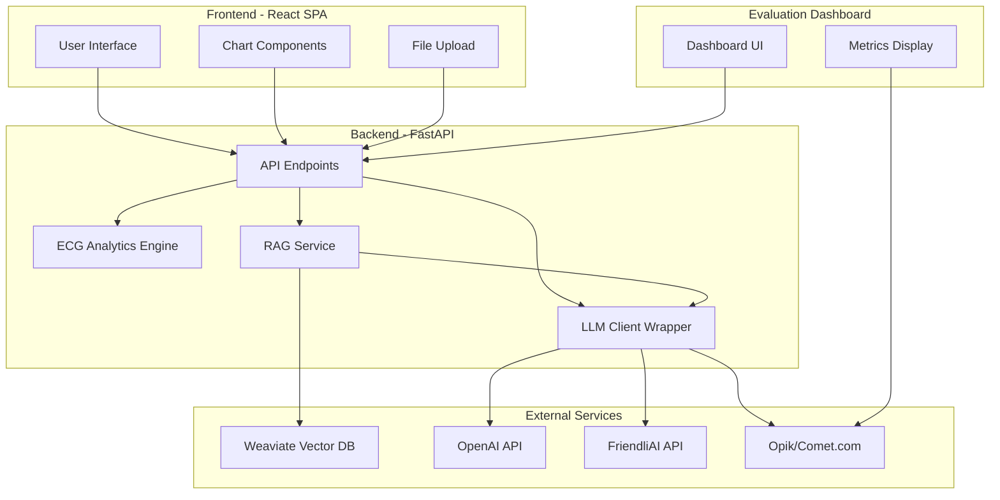

# Design Document

## Overview

NeuralECG is a single-page browser application with a Python FastAPI backend that provides ECG analysis and AI-powered insights for dialysis patients. The architecture follows a three-tier pattern: React frontend for visualization, FastAPI backend for computation and orchestration, and external services (Weaviate, OpenAI/FriendliAI) for AI capabilities. The system is designed as a proof-of-concept with minimal authentication and focuses on rapid analysis and clear visualization of cardiovascular metrics.

## Architecture

### High-Level Architecture



### Technology Stack

**Frontend:**
- React 18+ (or Next.js for simplified routing)
- Chart library: react-chartjs-2 or recharts
- UI framework: Tailwind CSS (minimal styling)
- HTTP client: fetch API or axios

**Backend:**
- Python 3.9+
- FastAPI framework
- pandas, numpy, scipy for signal processing
- pydantic for data validation
- python-multipart for file uploads
- openai Python client (supports both OpenAI and FriendliAI via base_url)
- weaviate-client for vector database

**Infrastructure:**
- Weaviate Cloud or local Docker instance
- Opik (Comet.com) for LLM observability and evaluation
- Environment-based configuration (.env file pattern)
- No database for application state (stateless POC)

### Deployment Model

- Frontend: Static build served via simple HTTP server or Next.js dev server
- Backend: FastAPI with uvicorn ASGI server
- Development mode: Both running locally on different ports (e.g., 3000 for frontend, 8000 for backend)
- CORS enabled on backend to allow frontend requests

## Components and Interfaces

### Frontend Components

#### 1. Main Layout Component
- **Responsibility**: Overall page structure with three-panel layout
- **State Management**: 
  - Current analytics data
  - LLM provider selection
  - Patient context inputs
  - Loading states
- **Child Components**: UploadPanel, VisualizationPanel, InsightsPanel

#### 2. UploadPanel Component
- **Responsibility**: File upload and sample data loading
- **Props**: onAnalyze callback
- **UI Elements**:
  - File input button
  - "Use Sample ECG" button
  - LLM provider dropdown (OpenAI/FriendliAI)
  - Patient context inputs (age, years on dialysis)
- **API Calls**:
  - POST /api/ecg/analyze (with file)
  - GET /api/ecg/sample

#### 3. VisualizationPanel Component
- **Responsibility**: Display correlation matrix and time-series overlay
- **Props**: analyticsData
- **Sub-components**:
  - CorrelationHeatmap: 12x12 grid with color coding and tooltips
  - LeadOverlayChart: Line chart with two leads overlaid
- **Chart Configuration**:
  - Heatmap: Color scale from red (-1) → yellow (0) → green (1)
  - Overlay: Dual-axis line chart with legend

#### 4. InsightsPanel Component
- **Responsibility**: Display metrics, risk flags, and AI summaries
- **Props**: analyticsData, llmProvider
- **Sub-components**:
  - MetricTiles: Grid of HR, PR, QRS, QT, QTc, Axis with color coding
  - AxisRadialChart: Pie/radial chart showing axis deviation
  - RiskFlagsList: Bullet list with severity badges
  - AISummaryCard: Text display with "Generate" button
  - RAGQueryCard: Textarea input + answer display
- **API Calls**:
  - POST /api/ecg/summary
  - POST /api/rag/query

### Backend Components

#### 1. API Layer (main.py)

**Endpoints:**

```python
@app.get("/health")
async def health_check()
    # Returns service status

@app.post("/api/ecg/analyze")
async def analyze_ecg(file: UploadFile)
    # Parse CSV, call ECG engine, return analytics JSON

@app.get("/api/ecg/sample")
async def get_sample_ecg()
    # Load sample CSV, call ECG engine, return analytics JSON

@app.post("/api/ecg/summary")
async def generate_summary(request: SummaryRequest)
    # Call LLM client with analytics + context, return summary

@app.post("/api/rag/query")
async def rag_query(request: RAGQueryRequest)
    # Call RAG service, return answer + citations
```

**CORS Configuration:**
```python
app.add_middleware(
    CORSMiddleware,
    allow_origins=["http://localhost:3000"],
    allow_methods=["*"],
    allow_headers=["*"],
)
```

#### 2. ECG Analytics Engine (ecg_engine.py)

**Core Functions:**

```python
def analyze_ecg(df: pd.DataFrame) -> AnalyticsJSON:
    """
    Main analysis pipeline
    - Validate columns
    - Compute correlation matrix
    - Detect peaks and compute intervals
    - Calculate axis
    - Generate risk flags
    - Extract overlay window
    """
    
def compute_correlation_matrix(df: pd.DataFrame) -> dict:
    """Uses np.corrcoef on 12 lead columns"""
    
def compute_intervals(df: pd.DataFrame, sampling_rate: int) -> dict:
    """
    - Detect R peaks using scipy.signal.find_peaks
    - Compute RR intervals → HR
    - Estimate PR, QRS, QT using fixed offsets (POC-level)
    - Calculate QTc using Bazett formula
    """
    
def compute_axis(df: pd.DataFrame) -> dict:
    """
    - Use lead I (D1) and aVF
    - Calculate angle using arctan2
    - Classify as normal/left/right deviation
    """
    
def generate_risk_flags(intervals: dict, axis: dict) -> list:
    """
    Rule-based checks:
    - QTc > 450/460 → prolonged_qtc
    - QRS > 120 → wide_qrs
    - HR > 100 → tachycardia
    - HR < 50 → bradycardia
    - Axis < -30 → left_axis_deviation
    - Axis > 90 → right_axis_deviation
    """
    
def extract_overlay_window(df: pd.DataFrame, peak_idx: int) -> dict:
    """
    Extract 1-2 second window around peak
    Return time series for V2 and V5
    """
```

**Peak Detection Strategy (POC-level):**
- Use scipy.signal.find_peaks on a chosen lead (e.g., V2)
- Parameters: minimum height threshold, minimum distance between peaks
- For intervals: Use simple fixed offsets from R peak (not production-grade but sufficient for POC)
  - P wave: ~150ms before R
  - QRS start: ~50ms before R
  - QRS end: ~50ms after R
  - T wave end: ~300ms after R

#### 3. LLM Client Wrapper (llm_client.py)

**Interface:**

```python
class LLMClient:
    def __init__(self, provider: str):
        """Initialize based on env vars"""
        
    def call_llm(self, system_prompt: str, user_prompt: str) -> dict:
        """
        Returns: {
            "text": "...",
            "model_used": "gpt-4" or "friendli-model"
        }
        """
        
    def get_embedding(self, text: str) -> list[float]:
        """For document ingestion"""
```

**Provider Switching:**
- Read LLM_PROVIDER env var
- If "friendli": Use FRIENDLI_BASE_URL + FRIENDLI_API_KEY
- If "openai": Use standard OpenAI client
- OpenAI client supports custom base_url for FriendliAI compatibility

**Prompt Templates:**

```python
SUMMARY_SYSTEM_PROMPT = """
You are a cardiology assistant helping interpret 12-lead ECGs for dialysis patients.
Be concise, non-alarmist, and avoid giving treatment instructions.
"""

SUMMARY_USER_PROMPT_TEMPLATE = """
Here are the ECG measurements and derived metrics:
{analytics_summary}

The patient is on dialysis{patient_context}.

1) Summarize the main findings in 3-5 sentences.
2) List 3-5 potential cardiovascular risks or considerations relevant to dialysis patients, referencing the ECG findings.
"""

RAG_SYSTEM_PROMPT = """
You answer clinician questions about dialysis patients using the provided medical excerpts.
If something is not supported by the excerpts, say you are uncertain.
"""

RAG_USER_PROMPT_TEMPLATE = """
Context from medical literature:
{context_chunks}

ECG Summary: {analytics_brief}

Question: {user_question}
"""
```

#### 4. RAG Service (rag_service.py)

**Interface:**

```python
class RAGService:
    def __init__(self, weaviate_client, llm_client):
        """Initialize with Weaviate and LLM clients"""
        
    def query(self, question: str, analytics: dict) -> dict:
        """
        1. Construct search query from question + key analytics
        2. Query Weaviate for top 3 chunks
        3. Compose prompt with context
        4. Call LLM
        5. Return answer + citations
        """
        
    def construct_search_query(self, question: str, analytics: dict) -> str:
        """
        Extract key findings from analytics (e.g., "left axis deviation", "prolonged QT")
        Combine with question
        Example: "dialysis patient left axis deviation prolonged QT cardiovascular risk"
        """
```

**Weaviate Schema:**

```python
MedicalDoc = {
    "class": "MedicalDoc",
    "properties": [
        {"name": "title", "dataType": ["text"]},
        {"name": "source", "dataType": ["text"]},
        {"name": "text_chunk", "dataType": ["text"]},
        {"name": "chunk_index", "dataType": ["int"]},
    ],
    "vectorizer": "none"  # We provide embeddings
}
```

#### 5. Document Loader Script (load_docs.py)

**CLI Tool:**

```python
def load_documents(docs_path: str):
    """
    1. Read all PDFs from docs_path
    2. Extract text using PyPDF2 or pdfplumber
    3. Chunk into 500-1000 tokens
    4. Generate embeddings via LLM client
    5. Store in Weaviate with metadata
    """
    
def chunk_text(text: str, max_tokens: int = 1000) -> list[str]:
    """
    Simple chunking by paragraph or sentence boundaries
    Ensure chunks don't exceed max_tokens
    """
```

**Usage:**
```bash
python load_docs.py --docs-path ./data/medical_docs
```

#### 6. Opik Integration (opik_tracker.py)

**Interface:**

```python
class OpikTracker:
    def __init__(self, api_key: str, workspace: str, project_name: str):
        """Initialize Opik client with credentials"""
        
    def track_llm_call(
        self,
        trace_name: str,
        input_data: dict,
        output_data: dict,
        metadata: dict
    ) -> str:
        """
        Log LLM call to Opik
        Returns trace_id for reference
        """
        
    def track_summary_generation(
        self,
        analytics: dict,
        patient_context: dict,
        summary: str,
        provider: str,
        model: str,
        response_time_ms: float,
        token_count: dict
    ):
        """Track ECG summary generation"""
        
    def track_rag_query(
        self,
        question: str,
        retrieved_chunks: list,
        answer: str,
        citations: list,
        provider: str,
        model: str,
        response_time_ms: float,
        token_count: dict
    ):
        """Track RAG Q&A interaction"""
        
    def get_metrics_summary(self) -> dict:
        """
        Fetch aggregated metrics from Opik
        Returns: {
            "total_calls": int,
            "calls_by_provider": {"openai": int, "friendli": int},
            "avg_response_time_ms": {"openai": float, "friendli": float},
            "total_tokens": {"openai": int, "friendli": int},
            "recent_traces": [...]
        }
        """
```

**Implementation Strategy:**

```python
# Decorator pattern for automatic tracking
def track_with_opik(trace_name: str):
    def decorator(func):
        @wraps(func)
        def wrapper(*args, **kwargs):
            start_time = time.time()
            try:
                result = func(*args, **kwargs)
                response_time_ms = (time.time() - start_time) * 1000
                
                # Log to Opik if configured
                if opik_tracker:
                    opik_tracker.track_llm_call(
                        trace_name=trace_name,
                        input_data={"args": args, "kwargs": kwargs},
                        output_data=result,
                        metadata={"response_time_ms": response_time_ms}
                    )
                
                return result
            except Exception as e:
                # Log error to Opik
                if opik_tracker:
                    opik_tracker.track_error(trace_name, str(e))
                raise
        return wrapper
    return decorator
```

#### 7. Evaluation Dashboard (dashboard.py)

**Backend Dashboard Endpoint:**

```python
@app.get("/dashboard")
async def evaluation_dashboard():
    """
    Serve simple HTML dashboard showing LLM metrics
    Returns HTML page with embedded metrics
    """
    
@app.get("/api/evaluation/metrics")
async def get_evaluation_metrics():
    """
    Return JSON metrics for dashboard
    """
```

**Dashboard HTML Template:**

```html
<!DOCTYPE html>
<html>
<head>
    <title>NeuralECG - LLM Evaluation Dashboard</title>
    <style>
        /* Simple CSS for metrics display */
    </style>
</head>
<body>
    <h1>LLM Evaluation Dashboard</h1>
    
    <section class="metrics-summary">
        <div class="metric-card">
            <h3>Total LLM Calls</h3>
            <p class="metric-value">{{total_calls}}</p>
        </div>
        <div class="metric-card">
            <h3>OpenAI Calls</h3>
            <p class="metric-value">{{openai_calls}}</p>
            <p class="metric-detail">Avg: {{openai_avg_time}}ms</p>
        </div>
        <div class="metric-card">
            <h3>FriendliAI Calls</h3>
            <p class="metric-value">{{friendli_calls}}</p>
            <p class="metric-detail">Avg: {{friendli_avg_time}}ms</p>
        </div>
    </section>
    
    <section class="recent-traces">
        <h2>Recent Traces</h2>
        <table>
            <thead>
                <tr>
                    <th>Timestamp</th>
                    <th>Type</th>
                    <th>Provider</th>
                    <th>Response Time</th>
                    <th>Tokens</th>
                </tr>
            </thead>
            <tbody>
                <!-- Populated from API -->
            </tbody>
        </table>
    </section>
    
    <section class="opik-link">
        <a href="https://www.comet.com/opik/{{workspace}}/{{project}}" target="_blank">
            View Full Dashboard on Comet.com →
        </a>
    </section>
</body>
</html>
```

## Data Models

### Analytics JSON Schema

```typescript
interface AnalyticsJSON {
  meta: {
    patient_id?: string;
    sampling_rate: number;  // Hz
    duration_seconds: number;
  };
  
  lead_stats: {
    [leadName: string]: {
      mean: number;
      std: number;
      max: number;
      min: number;
    };
  };
  
  correlation: {
    matrix: number[][];  // 12x12
    lead_labels: string[];  // ["aVR", "aVL", ...]
  };
  
  intervals: {
    heart_rate_bpm: number;
    pr_ms: number;
    qrs_ms: number;
    qt_ms: number;
    qtc_ms: number;
    axis_deg: number;
    axis_bucket: "normal" | "left_axis_deviation" | "right_axis_deviation";
  };
  
  time_series_overlay: {
    time: number[];  // seconds
    lead1: {
      label: string;  // e.g., "V2"
      values: number[];
    };
    lead2: {
      label: string;  // e.g., "V5"
      values: number[];
    };
  };
  
  risk_flags: RiskFlag[];
}

interface RiskFlag {
  id: string;  // e.g., "prolonged_qtc"
  severity: "mild" | "moderate" | "severe";
  message: string;
}
```

### API Request/Response Models

```python
# Pydantic models for FastAPI

class SummaryRequest(BaseModel):
    analytics: dict  # AnalyticsJSON
    patient_context: Optional[dict] = None  # {is_dialysis: bool, years_on_dialysis: int}

class SummaryResponse(BaseModel):
    summary_text: str
    model_used: str

class RAGQueryRequest(BaseModel):
    question: str
    analytics: dict  # AnalyticsJSON

class RAGQueryResponse(BaseModel):
    answer: str
    citations: list[dict]  # [{title: str, source: str}]
    model_used: str
```

### ECG CSV Format

Expected columns:
- `time`: Timestamp or sample index
- `avr`, `avl`, `avf`: Augmented limb leads
- `v1`, `v2`, `v3`, `v4`, `v5`, `v6`: Precordial leads
- `d1`, `d2`, `d3`: Standard limb leads (or `I`, `II`, `III`)

Column names are case-insensitive. Missing leads will cause validation error.

## Error Handling

### Frontend Error Handling

**File Upload Errors:**
- Invalid file format → Display error message: "Please upload a valid CSV file"
- Missing columns → Display error message: "CSV missing required leads: [list]"
- Network errors → Display error message: "Unable to connect to server. Please try again."

**API Call Errors:**
- Timeout (>30s) → Display error message: "Request timed out. Please try again."
- 500 errors → Display error message: "Server error. Please contact support."
- Display all errors in a toast notification or alert banner

**Chart Rendering Errors:**
- Invalid data → Display placeholder message: "Unable to render chart"
- Log errors to console for debugging

### Backend Error Handling

**ECG Analysis Errors:**
```python
class ECGValidationError(Exception):
    """Raised when CSV is invalid"""

class ECGProcessingError(Exception):
    """Raised when analysis fails"""

# In endpoint:
try:
    analytics = analyze_ecg(df)
except ECGValidationError as e:
    raise HTTPException(status_code=400, detail=str(e))
except ECGProcessingError as e:
    raise HTTPException(status_code=500, detail="ECG processing failed")
```

**LLM Errors:**
- API key invalid → Log error, return 500 with message "LLM service unavailable"
- Rate limit exceeded → Return 429 with message "Rate limit exceeded. Please try again later."
- Timeout → Retry once, then return error
- If FriendliAI fails, optionally fall back to OpenAI (log the fallback)

**Weaviate Errors:**
- Connection failed → Log error, return 500 with message "Vector database unavailable"
- No results found → Return empty citations list with note in answer
- Query timeout → Return error after 10 seconds

**Logging Strategy:**
- Use Python logging module
- Log levels:
  - INFO: Successful requests, analysis completion
  - WARNING: Fallback to alternate LLM, missing optional data
  - ERROR: Failed requests, exceptions
- Log format: `[timestamp] [level] [component] message`
- In POC: Log to console; in production: Log to file or service

## Testing Strategy

### Frontend Testing

**Unit Tests (Optional):**
- Test utility functions (e.g., color mapping for heatmap)
- Test data transformation functions

**Integration Tests:**
- Mock API responses and test component rendering
- Test file upload flow with mock file
- Test chart rendering with sample data

**Manual Testing:**
- Upload various CSV files (valid, invalid, edge cases)
- Test all UI interactions (buttons, dropdowns, inputs)
- Verify charts render correctly across browsers
- Test responsive layout on different screen sizes

### Backend Testing

**Unit Tests:**
- Test ECG engine functions with known input/output:
  - `compute_correlation_matrix`: Verify matrix is symmetric, diagonal is 1.0
  - `compute_intervals`: Test with synthetic ECG data with known HR
  - `compute_axis`: Test with known lead values
  - `generate_risk_flags`: Test threshold logic
- Test LLM client with mocked API responses
- Test RAG service with mocked Weaviate responses

**Integration Tests:**
- Test full API endpoints with sample CSV files
- Test end-to-end flow: upload → analyze → summary → RAG query
- Test error handling paths (invalid CSV, missing env vars)

**API Testing:**
- Use pytest with FastAPI TestClient
- Test all endpoints with valid and invalid inputs
- Verify response schemas match pydantic models
- Test CORS headers

**Example Test:**
```python
def test_analyze_ecg_endpoint():
    with open("tests/fixtures/sample_ecg.csv", "rb") as f:
        response = client.post(
            "/api/ecg/analyze",
            files={"file": ("test.csv", f, "text/csv")}
        )
    assert response.status_code == 200
    data = response.json()
    assert "correlation" in data
    assert len(data["correlation"]["matrix"]) == 12
```

### External Service Testing

**Weaviate:**
- Test document ingestion with sample PDF
- Test vector search with known queries
- Verify embeddings are stored correctly

**LLM Providers:**
- Test both OpenAI and FriendliAI with same prompt
- Verify responses are reasonable (manual review)
- Test fallback mechanism if one provider fails

### Performance Testing (POC-level)

**Target Metrics:**
- ECG analysis: < 5 seconds for 10-second ECG
- LLM summary: < 10 seconds
- RAG query: < 15 seconds
- Frontend load time: < 2 seconds

**Load Testing (Optional):**
- Test with multiple concurrent requests (5-10)
- Verify no memory leaks with repeated analyses

## Configuration Management

### Environment Variables

**Required:**
```bash
# LLM Configuration
OPENAI_API_KEY=sk-...
FRIENDLI_TOKEN=...
FRIENDLI_TEAM_ID=...
LLM_PROVIDER=openai  # or friendli

# Weaviate Configuration
WEAVIATE_URL=https://your-cluster.weaviate.network
WEAVIATE_API_KEY=...

# Application Configuration
DOCS_PATH=./data/medical_docs
SAMPLE_ECG_PATH=./data/sample_ecg.csv
```

**Optional (Evaluation):**
```bash
# Opik Configuration
OPIK_API_KEY=...
OPIK_WORKSPACE=anup-pradhan
OPIK_PROJECT_NAME=neuralecg
```

**Optional:**
```bash
# Server Configuration
BACKEND_PORT=8000
FRONTEND_PORT=3000
LOG_LEVEL=INFO

# Feature Flags
ENABLE_FRIENDLI_FALLBACK=true
```

### Configuration Loading

```python
# config.py
from pydantic_settings import BaseSettings
from typing import Optional

class Settings(BaseSettings):
    # LLM Configuration
    openai_api_key: str
    friendli_token: Optional[str] = None
    friendli_team_id: Optional[str] = None
    llm_provider: str = "openai"
    
    # Weaviate Configuration
    weaviate_url: str
    weaviate_api_key: str
    
    # Opik Configuration (Optional)
    opik_api_key: Optional[str] = None
    opik_workspace: Optional[str] = None
    opik_project_name: str = "neuralecg"
    
    # Application Configuration
    docs_path: str = "./data/medical_docs"
    sample_ecg_path: str = "./data/sample_ecg.csv"
    
    class Config:
        env_file = ".env"
        case_sensitive = False

settings = Settings()
```

## Security Considerations (POC-level)

**Note:** This is a POC with no production hardening. The following are minimal security measures:

1. **API Keys:** Store in .env file, never commit to git (.gitignore)
2. **CORS:** Restrict to known frontend origin (localhost:3000 for dev)
3. **File Upload:** Validate file type and size (max 10MB)
4. **Input Validation:** Use pydantic models to validate all API inputs
5. **No Authentication:** POC has no user auth; all data is ephemeral
6. **No PHI Storage:** Do not persist patient data; all processing is in-memory

**Future Production Considerations:**
- Add authentication (OAuth2, JWT)
- Encrypt data at rest and in transit
- Implement rate limiting
- Add audit logging
- HIPAA compliance measures
- Secure file storage with encryption

## Deployment Instructions (POC)

### Prerequisites
- Python 3.9+
- Node.js 16+
- Weaviate instance (cloud or local Docker)
- OpenAI and/or FriendliAI API keys

### Backend Setup
```bash
cd backend
python -m venv venv
source venv/bin/activate  # or venv\Scripts\activate on Windows
pip install -r requirements.txt
cp .env.example .env
# Edit .env with your API keys
python load_docs.py  # Load medical documents
uvicorn main:app --reload --port 8000
```

### Frontend Setup
```bash
cd frontend
npm install
npm run dev  # Starts on port 3000
```

### Access
- Frontend: http://localhost:3000
- Backend API: http://localhost:8000
- API Docs: http://localhost:8000/docs

## Future Enhancements (Out of Scope for POC)

1. **Advanced Signal Processing:**
   - Production-grade QRS detection algorithms
   - Automated P and T wave detection
   - ST segment analysis
   - Arrhythmia detection

2. **Enhanced Visualizations:**
   - Interactive 12-lead grid view
   - Zoom and pan on time-series
   - Comparison with previous ECGs
   - Export charts as images

3. **Machine Learning:**
   - Train custom models for ECG classification
   - Predict specific conditions (MI, arrhythmias)
   - Risk scoring models

4. **Clinical Features:**
   - Patient history tracking
   - Multi-ECG comparison
   - Report generation (PDF)
   - Integration with EHR systems

5. **Production Hardening:**
   - User authentication and authorization
   - Multi-tenancy support
   - Database for persistent storage
   - Comprehensive audit logging
   - HIPAA compliance
   - Scalability (load balancing, caching)
